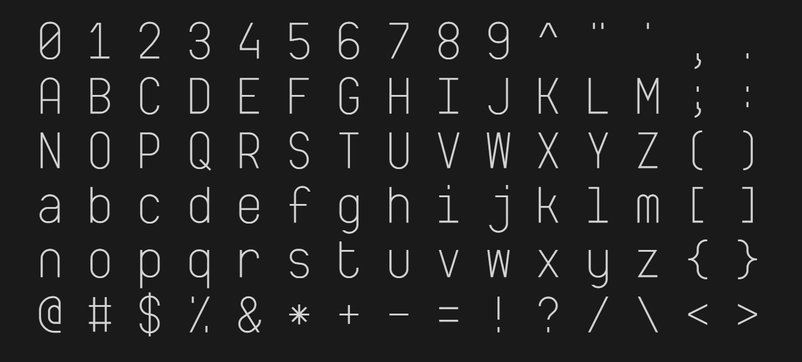

# Assembly Line & Idealist Hacker Mono

**Assembly Line** is a rounder and more conventional variant of [Idealist Hacker Mono](https://github.com/teadrinker/idealist-hacker-mono-font). Both are procedural/custom non-standard typefaces developed for [Mad Tea Synth](https://github.com/teadrinker/mad-tea-synth).

This repo contains both fonts exported to ttf + woff2 in multiple weights (+tight box option).

### [View / Compare](https://teadrinker.github.io/assembly-line-font/test.html)

See [original repo](https://github.com/teadrinker/idealist-hacker-mono-font) for more info. 

